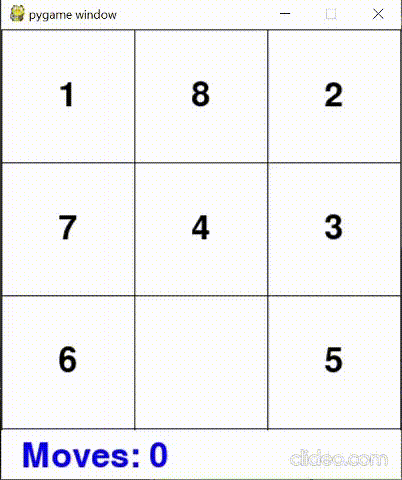

# 8-Puzzle GUI Game+Solver

This is a 8-Puzzle Solver using A* search algorithm.
here, i've used **Manhattan Distance** and **Hamming Function** as Heuristic (h-score) and **Level of Node** in a tree as (g-score).

# Instructions
Click a box which can be moved i.e (box having free space in neighbour) to make a move.
Press SPACE key to shuffle the board.
Press ENTER key, sit back and watch the algorithm solving the puzzle.

# PROBLEM FORMULATION
- Goal: Goal State is initially given.
- State: Instance of Puzzle.
- Actions: Move the blank tile in left, up, down and right positions
- Performance: Number of total moves in the solution

# A* ALGORITHM

A* is an informed search algorithm used in path findings and graph traversals. It is a
combination of uniform cost search and best first search, which avoids expanding expensive
paths. A* star uses admissible heuristics which is optimal as it never over-estimates the path
to goal. The evaluation function A* star uses for calculating distance is

- f(n) = g(n) + h(n)
- g(n) = cost so far to reach n
- h(n) = estimated cost from n to goal
- f(n) = estimated total cost of path through n to goal

# Heuristic Functions
The heuristic function is a way to inform the search regarding the direction to a goal. It provides
an information to estimate which neighboring node will lead to the goal. The two heuristic
functions that we considered for solving 8-puzzle problem are
